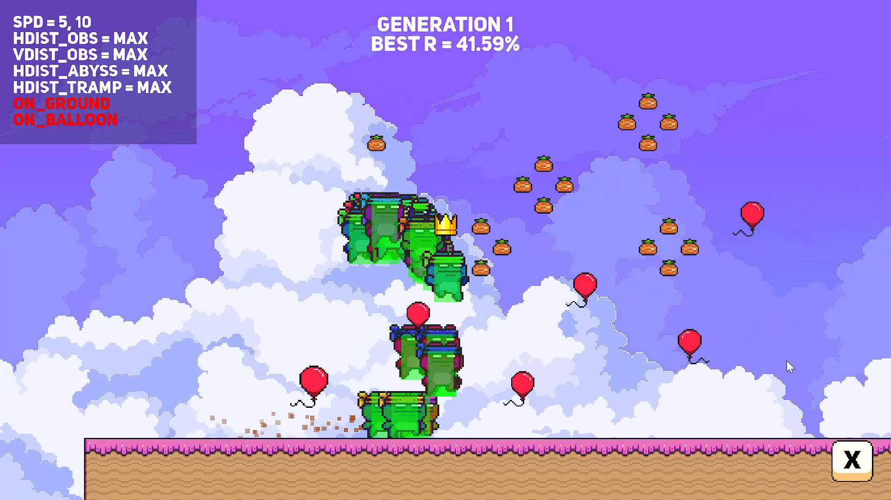
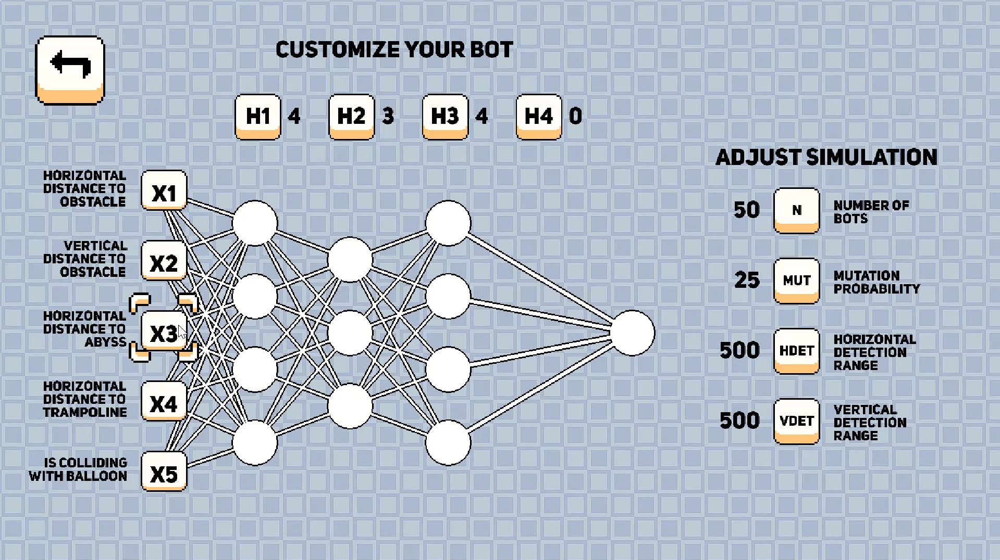

# Frog Jump – Reinforcement Learning Platformer

This is an experimental AI project of Reinforcement Learning applied to a platformer styled game.

In **Frog Jump**, play either as a human or let a bot learn how to win a level.

You can customize the settings of the simulation and neural network to guide your bot learning process.  
(*RL with Neural Network + Genetic Algorithm*)

---

## 🧠 How It Works

In **AI mode**, a simulation with *N* bots will start, each one with an internal neural network.

Each network can have:
- Up to **5 sensors**
- **4 hidden layers**
- **1 output neuron**

Each iteration of the simulation runs a reinforcement learning process optimized by **genetic algorithms**.  
At the end of each iteration, the **best bot** is mutated several times to build a new population for the next iteration.  
This process continues until the level is completed.

---

## ⚙️ Adjustable Parameters

- Number of sensors  
- Number of hidden layers  
- Size of hidden layers  
- Probability of mutation  
- Number of bots per iteration  
- Bot's horizontal detection range  
- Bot's vertical detection range  

---

## 📌 Fixed Parameters

- Hidden layers use **RELU** activation function  
- Output layer uses **Sigmoid** function  
- Decision threshold is **0.5** for output neuron  
- Mutation is **element-wise** with a normal range of (-2, 2)  
- Initial population is randomized  

---

## 🎮 Controls

- **Click / Space** – Jump  
- **Escape** – Exit  

